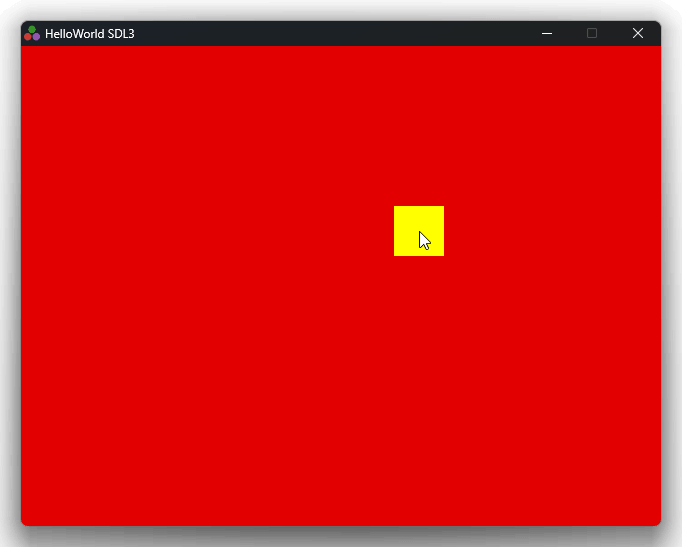

# julia SDL3 test (SDL3Test.jl)



## Run

```bash
$ julia --project=@. -e 'using Pkg; Pkg.instantiate()'
$ julia --project=@. -e 'using SDL3Test; SDL3Test.main()'
```

## Compile standalone executable

NOTE: This takes minutes. Be patient.

```bash
$ julia --project=@. -e 'using Pkg; Pkg.add("PackageCompiler")'
$ julia --project=@. -e 'using PackageCompiler; create_app(".", "build", force=true, incremental=true)'

$ ./build/bin/SDL3Test
```
